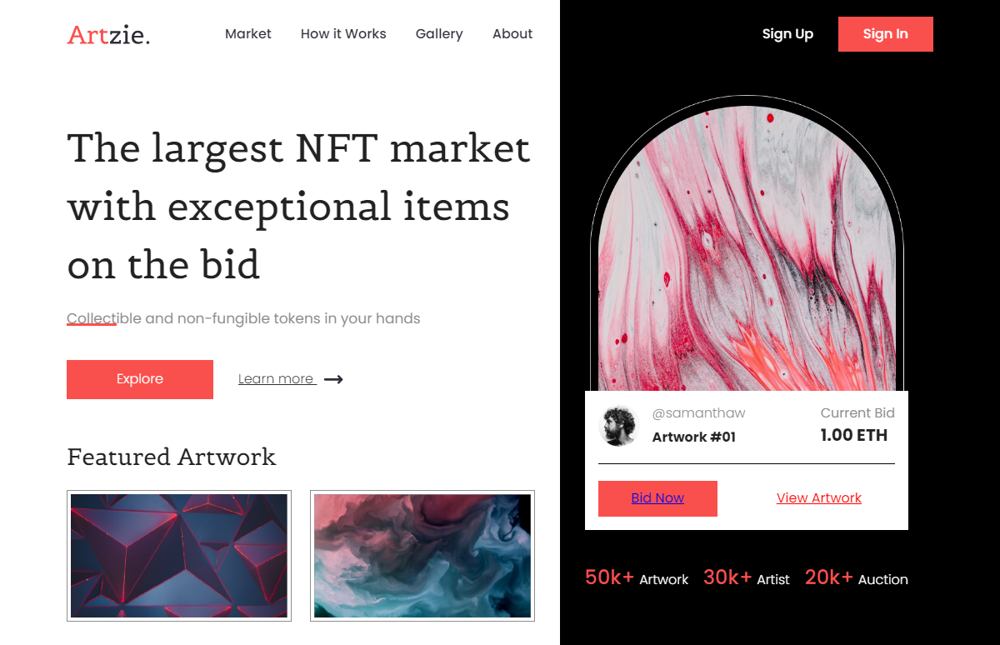

# NFT Marketplace Header 🌐

Este proyecto presenta un Header de un NFT marketplace preparado para una pantalla de 1200px de ancho.

---

<div align="center">
  
</div>


---


## Tecnologías Utilizadas ⚙️

- [](src/index.html)
- [](src/sass/)


## Cómo Empezar 🚀

Sigue estos pasos para configurar y ejecutar el proyecto en tu entorno local:

### 🔍 Requisitos Previos

- Git instalado
- Visual Studio Code
- Extensiones recomendadas:
  - Live Server
  - (Otras extensiones relevantes para tu proyecto)

### 📦 Cómo Clonar el Repositorio

1. Abre la terminal de tu computadora
2. Navega al directorio donde quieres clonar el proyecto
3. Ejecuta el siguiente comando:

```bash
git clone https://github.israelinxy/header-nft-marketplace.git
```
4. Abre el proyecto en Visual Studio Code:

```bash
cd tu-repositorio
code .
```


### 🚀 Visualización del Proyecto

#### Usando Live Server
1. Instala la extensión "Live Server" en VS Code
2. Haz clic derecho en tu archivo `index.html`
3. Selecciona "Open with Live Server"


Con estos pasos, deberías poder comenzar a trabajar con el proyecto sin problemas. ¡Disfruta desarrollando! 🚀💻

## Contribuciones 🤝

Las contribuciones son bienvenidas. Para problemas, ideas o nuevas características, por favor abre un issue o un pull request.

## Contacto 📫

¿Necesitas un diseño web personalizado? Contáctame:

[](mailto:israelcolladom@gmail.com)

## Licencia 📜

Este proyecto está bajo la licencia [MIT](LICENSE).
